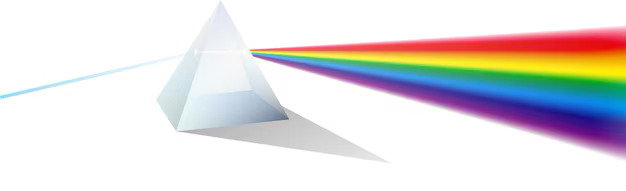
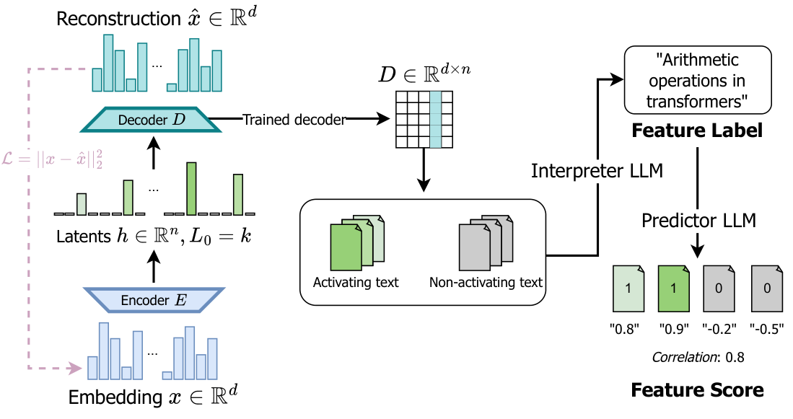
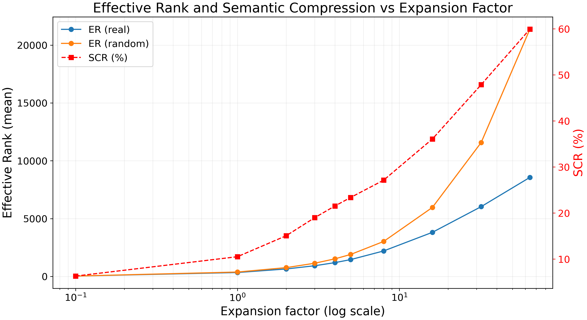
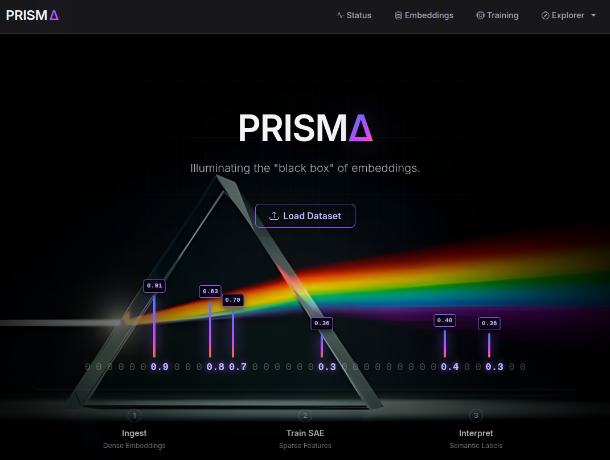

# P.R.I.S.M.A. 
**Projection of Representations for Interpretability via Sparse Monosemantic Autoencoders**

Tesi di Laurea Magistrale in Fisica — Universit&agrave; degli Studi di Milano, A.A. 2024–2025

**Candidato:** Edoardo Tedesco
**Relatore esterno:** Prof. Mirko Cesarini
**Relatore interno:** Prof. Marco Gherardi

---

<p align="center">
  
</p>

## Abstract

Le rappresentazioni dense apprese dai modelli linguistici — gli *embedding* — codificano informazione semantica ricchissima ma risultano opache: ogni neurone partecipa alla codifica di molteplici concetti (*polisemanticità*). La *Superposition Hypothesis* spiega questo fenomeno come una strategia di compressione in cui il numero di concetti supera il numero di neuroni disponibili.

**PRISMA** — analogamente a un prisma ottico che scompone la luce bianca nelle sue componenti cromatiche — scompone le rappresentazioni dense nei concetti atomici che le costituiscono, utilizzando **Sparse Autoencoders** (SAE) con vincolo di sparsit&agrave; Top-K.

Lo strumento &egrave; stato applicato a un corpus di ~2.5 milioni di abstract scientifici da arXiv, estraendo migliaia di *feature monosemantiche* organizzate spontaneamente in 590 famiglie gerarchiche. L'etichettatura semantica delle feature &egrave; automatizzata tramite un LLM locale (Gemma 3 27B), senza trasmissione di dati a servizi esterni.

Come contributo originale viene introdotto il **Semantic Compression Ratio** (SCR), una metrica basata sull'*Effective Rank* che misura la riduzione della dimensionalit&agrave; effettiva del codice sparso rispetto a un'ipotesi nulla: la compressione raggiunge il 59.9% per expansion factor 64, dimostrando che la semantica si manifesta come riduzione dei gradi di libert&agrave; nello spazio dei concetti estratti.

## Il metodo

Lo Sparse Autoencoder proietta gli embedding densi in uno spazio latente *overcomplete* (n > d), imponendo un vincolo di sparsit&agrave; Top-K che forza solo poche feature ad attivarsi per ogni input. La linearit&agrave; del decoder garantisce che ogni feature corrisponda a una direzione interpretabile nello spazio degli embedding. L'etichettatura semantica &egrave; automatizzata tramite un LLM che analizza i testi che massimizzano l'attivazione di ciascuna feature.

<p align="center">
  <br>
  <em>Pipeline di training e feature labelling del SAE</em>
</p>

## Risultati principali

L'analisi dell'*Effective Rank* rivela che lo spazio latente ha dimensionalit&agrave; effettiva sistematicamente inferiore rispetto all'ipotesi nulla (SAE addestrato su input casuali). Il **Semantic Compression Ratio** cresce monotonicamente con l'expansion factor, raggiungendo il **59.9%** per &rho; = 64: la semantica si manifesta come riduzione dei gradi di libert&agrave; nello spazio dei concetti estratti, poich&eacute; i concetti non sono indipendenti ma vincolati da relazioni di co-attivazione che riflettono la struttura del dominio.

<p align="center">
  <br>
  <em>Effective Rank vs Expansion Factor (dati reali vs ipotesi nulla) e Semantic Compression Ratio</em>
</p>

## L'applicazione

<p align="center">
  <br>
  <em>Home page di PRISMA</em>
</p>

## Struttura del repository

```
main/               Tesi completa (LaTeX)
  chapters/         Capitoli della tesi
  pictures/         Figure e immagini
  references.bib    Bibliografia
summary/            Riassunto della tesi
talk/               Presentazione (slides Beamer)
```

### Capitoli

1. **Introduzione** — Motivazioni, stato dell'arte, posizionamento del lavoro
2. **Autoencoders** — Architetture, vincoli e propriet&agrave; dello spazio latente
3. **Embeddings** — Da Word2Vec ai Transformer, rappresentazioni del linguaggio
4. **Disentanglement** — Superposition Hypothesis e polisemanticit&agrave;
5. **PRISMA** — Architettura SAE, loss Top-K, interpretazione automatica delle feature
6. **Risultati sperimentali** — Feature estratte, famiglie semantiche, Effective Rank e SCR
7. **Conclusioni** — Sintesi e direzioni future
8. **Appendice**

## Codice sorgente

Il codice sorgente dell'applicazione PRISMA &egrave; disponibile nel repository dedicato: [edoardoted99/PRISMA](https://github.com/edoardoted99/PRISMA)

## Compilazione

La tesi &egrave; scritta in LaTeX e richiede una distribuzione TeX con `biber` per la bibliografia:

```bash
cd main
pdflatex main.tex
biber main
pdflatex main.tex
pdflatex main.tex
```

## Licenza

Questo materiale &egrave; parte di una tesi di laurea. Tutti i diritti sono riservati all'autore.
